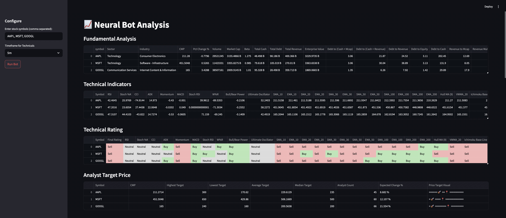
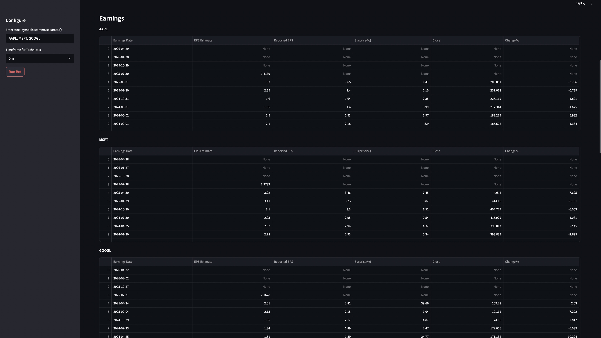
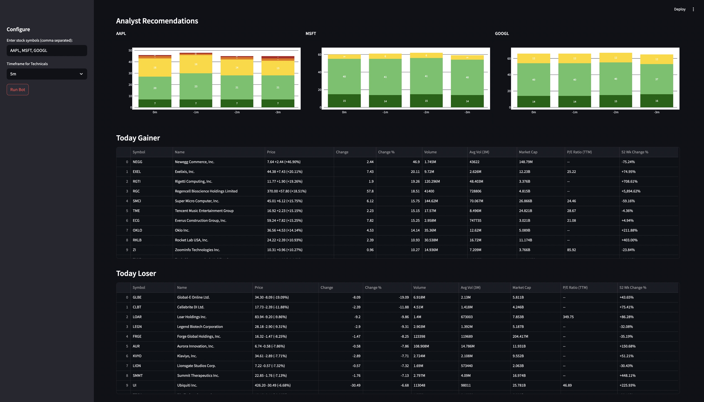
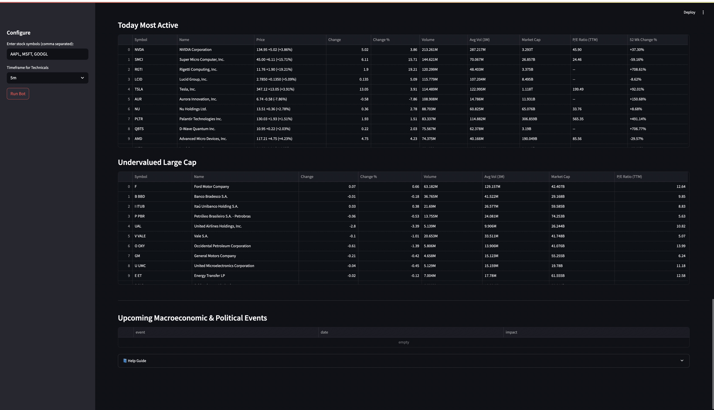

# 🧠 Neural Bot Analytics

A real-time stock analytics dashboard that performs **fundamental analysis**, **technical indicator modeling**, and **analyst sentiment breakdowns** — built with **Streamlit**, **yfinance**, and **TA-Lib**.

---

## 📊 Project Overview

This tool allows users to enter any combination of stock tickers (e.g., AAPL, MSFT, GOOGL) and receive:

- 📈 **Fundamental metrics** (market cap, revenue, debt ratios, etc.)
- 📉 **Technical indicators** 26 Technical Indicators (RSI, MACD, EMA, momentum, etc)
- 🤖 **Technical ratings** engine to identify Buy/Sell signals
- 📊 **Analyst price targets and sentiment**
- 💹 **Visual summaries** of market gainers, losers, undervalued large caps

---

🚀 Features
- Enter any stock tickers (e.g., AAPL, MSFT, GOOGL) for real-time breakdowns
- Perform technical analysis using RSI, MACD, EMA, Momentum indicators, 
- View analyst sentiment from Wall Street
- Detect bullish vs bearish trends using statistical signals
- Fully interactive Streamlit dashboard

---

💼 Use Case
This tool can help investors and analysts:
- Evaluate stocks with both technical and fundamental signals
- Visualize stock strength across multiple timeframes
- Gain confidence in investment decisions through AI-enhanced ratings

---
  

## 🖼️ Screenshots

### Dashboard Overview


### Earnings Table


### Analyst Recommendations


### Market Movers


---

## 🛠️ Technologies Used

- Python 3.12
- Streamlit
- yfinance
- pandas
- TA-Lib
- curl_cffi
- lxml-html-clean

---

## ⚙️ How to Run It Locally

```bash
# 1. Clone the repo
git clone https://github.com/shraavanib806/neural_bot_analytics.git
cd neural_bot_analytics

# 2. Create & activate a virtual environment
python3 -m venv venv
source venv/bin/activate

# 3. Install required libraries
pip install -r requirements.txt
pip install TA-Lib curl_cffi lxml-html-clean

# 4. Run the app
streamlit run neural_bot_beta.py
